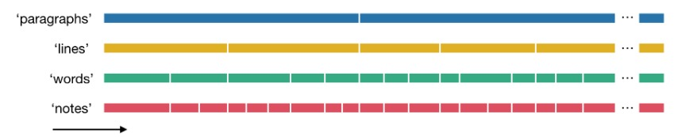
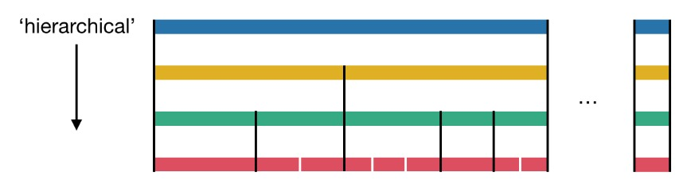
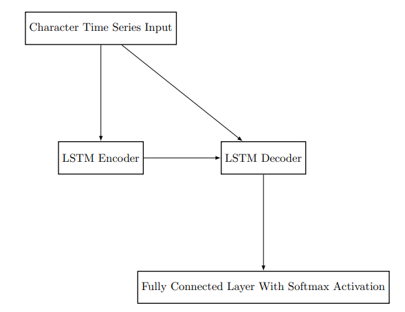
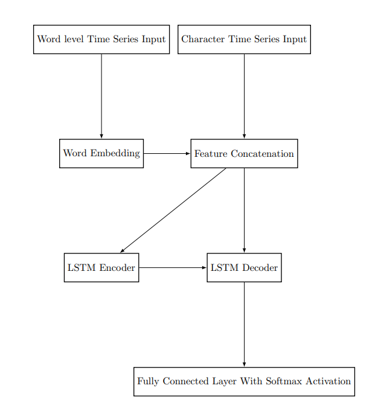
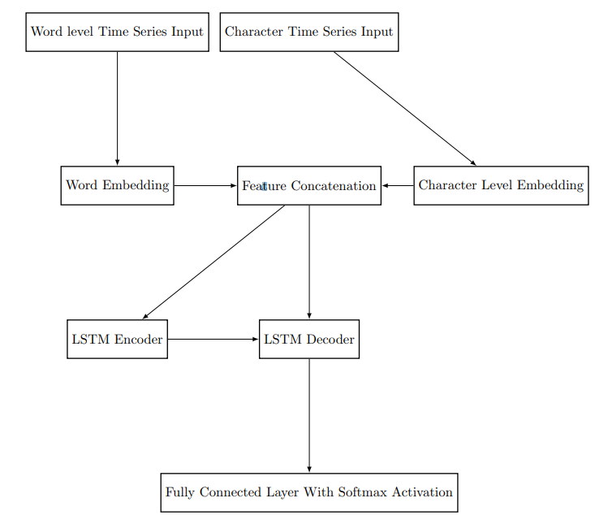
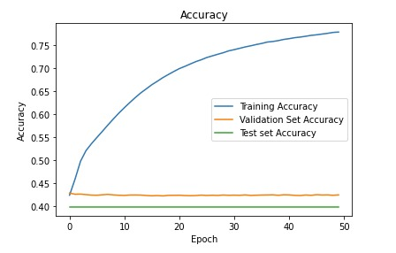

# Lyrics2Note

## Daniel Karalnik and Dan Pollak
### Submitted as final project report for the NLP course, IDC, 2020

## 1. Introduction

In this project we aim to try and implement a generative recurrent model with the goal of generating a genre
appropriate and fitting melody for a given song lyrics. We choose this subject due to our interests in music
and because we believe that solving a sophisticated task in one domain could lead to discovery of solution
and better understanding of tasks in other domain.

## 1.1 Related Works

Over the last couple of years there has been a considerable amount of work in the field of music generation,
from the MusicVAE [[RER+18]](#RER+18) network that is based on an hierarchial recurrent variational autoencoder
architecture that is able to generate completely new musical scores by utilizing its highly robust latent
space. Another interesting paper in the field is JukeBox [[DJP+20]](#DJP+20) that uses sparse transformers that were
trained on compressed musical scores to generate new music given an artist, genre and lyrics.
But neither of these papers or others in the field focus extensively on melody generation for a specific
lyrics using a natural language processing approach.

## 2 Solution

## 2.1 General approach

Our general approach to the lyrics to note problem involves the solving of the following sub-problems:

- Being able to map the various different musical notes to a meaningful semantic latent space.
- Map the various single letter characters to a meaningful latent space.
- Using our mappings to map a single character to a note (a classification problem).

In order to solve these sub-problems we intend to take the following steps:

- To this end we wish to propose an encoder-decoder sequence to sequence architecture that will map a
    given sequence of characters to their corresponding notes in order to create a melody.
- During training we intend to use teacher forcing in order to avoid error accumulation in the decoder.

## 2.2 Design

2.2.1 The Dataset

In our project we use the DALI [[MBCHP18]](#MBCHP18) dataset, this dataset contains hierarchial and vertical information
about each sub component of the song lyrics and melody (notes).

 

Figure 1: Each paragraph is divided to lines and each lines to words and each line to notes

 

Figure 2: At each point we know to which component in the hierarchy each sub component belongs to

From this dataset we are able to extract for each character in the lyrics its associated note and the word
that it is part of.
We also added additional vocabulary wise markers for spaces and starting notes (i.e for a start of A4 a tag
of A4S was created) for the semantic information.
In addition to this in order to avoid the problem of large buffers of EOS we took only the sentences that
had a length around the median.

2.2.2 Platform Used

We used Google Colab for all computations and data processing.
Google Drive was used to store and access the DALI dataset from within Colab.
Github was used for source control.
Keras was used for neural network training and construction.

## 3 Experimental results

Let us detail our the progress on our project:

1. We started with a basic seq2seq architecture:
    - The architecture received as input vectors representing sentences and their characters.
    - our ground truth is the note that was supposed to play for each character.
    - The architecture itself consisted of a LSTM encoder and LSTM decoder with a final fully connected
       layer that classified for each character its corresponding note according to the features that the
       decoder LSTM outputted.
    - This architecture while able to learn the some elements of the global structure such that EOS,
       SOS and BREAK characters correspond to their respective EOS, SOS and BREAK notes. But
       this model wasn’t able to learn that after a note start character (i.e A4S) all following notes until
       BREAK or another character must correspond to this note (i.e A4).
    - Overall accuracy of the model on the training, validation and test set was not high either.

- Changing the LSTM latent hidden layer size, the sizes of the batches or training for more epochs
    didn’t change the results.

 

Figure 3: our initial model, a simple sequence to sequence based architecture

2. To improve upon our previous model and inject additional semantic information we introduced an
    additional word level embedding layer to our architecture:
       - Instead having our feature sentence be composed of character indexes we concatenated to each
          character the embedding features of the word that it is a part of.
       - This resulted in a small increase to the the training accuracy but the network still wasn’t able to
          learn the start note structure consistently.

 

Figure 4: We added the additional word level input and an embedding layer for this input and then con-
catenated it with our raw character level input

3. When This didn’t give us the improvement we desired we decided to convert the encoder LSTM into
    a bidirectional LSTM:
       - We hoped that by taking into account both logical directions would allow the network to learn
          the the structure of the notes.
       - After retraining the model we saw that while the model didn’t always choose the correct notes
          when it chooses a note it start with the start note designation and stuck with the same note until
          it decided to assign a new start letter.
4. Considering our success with a the bidirectional encoder we decided to convert the Decoder into a
    bidirectional LSTM as well:
       - This improved our performance on the training set.
       - However our performance on the test and validation set remained low, while the model now was
          adhered to all structural rules it simply didn’t choose the correct notes.
5. As a final resort we decided to add an additional embedding layer for the characters themselves:

- By adding an embedding layer for the characters we hoped to model technical features among the
    characters such the sound they make or add some syntax wise information.
- This addition slightly improved our training accuracy but are model still failed on both validation
    and test set.

 

Figure 5: Our final model, Fully bidirectional with both Word level and character level embedding

The following graph shows our final training results:

 

Figure 6: While Our model was able to learn the distribution of the training data it failed to generalize it

However after some additional thought we decided to devise a new metrics to measure our model on
because several tunes and melody can be devised for a given lyrics thereby making accuracy not a good
enough measurement of our model success or failure.
We used the two following approaches:

- A test as to whether the output correct grammatically? - The first metric is very easy to test - We
    tested each line according to rules, with the most significant one being “Each note start should follow
    the same note (until break, EOS or a new note)”. On the test data, we had 2.91 errors in average per
    line, meaning our output was usually grammatically incorrect. We can explain that by the fact that
    our network was trained over characters, which might be causing the prediction to give more predictive
    power to the character and not acknowledging the semantics of the sentence.
- Does the melody sounds “correct”? -
    - The melody metrics proved much harder to measure. First, we had to make the notes “readable”,
       as our output was usually grammatically incorrect. We decided to use two different post-processing
       methods to “smooth” the notes. First approach was “First-Note”, meaning that the start of a
       note means that this note plays regardless of the continuation of the notes (until the start of the
       next note). This approach gives more significance to the semantics of the sentence, as we dismiss
       any note that was not decided as “start of note”. Second approach was “Majority Note”, meaning
       that we sum all the notes from the start of a note until its end, then decide by majority which
       note will be played. This approach gives more significance to the characters, as it might overturn
       the “start of note” notation.
    - Now, we had to decide what makes a melody “correct”. We decided that we want to measure
       the “distance” between the lowest note and the highest note in each line. Melodies usually stay
       in the same octaves, and if there are notes that are very far away from each other it might cause
       unpleasant melody. The metric itself was in comparison to the ground truth - we measured the
       distance in the prediction and the ground truth, and computed the difference so songs that had
       in their original form big notes span won’t cause noise.
    - In both post-processing methods, the average distance delta was 5.34 notes, where 12 notes is
       an octave (including “black keys”). This result is quite promising, as it means that the network
       knows that the notes should be in the same note span.

- We also wanted to measure the distance between each note in comparison to the ground truth,
    thinking that the changes between each note in the sentence measures how monotone the melody
    is - If the sentence has the same note all along, it is hardly considered a melody. The metric
    itself summed the deltas between each note in the sentence, and then the difference between the
    prediction and the ground truth. Again, in both post-processing methods, the average distance
    delta was around 7.3. The meaning of this result that our network manage to create “interesting”
    melodies and not one note melodies - but it also means that it might be sometimes too interesting,
    choosing notes that are further apart from each other, potentially causing unpleasant melodies.

Our final model was trained for 50 epochs with batch size 32, the LSTM embedding space was 100, the
word embedding space was 100 and the character embedding space was 10. Around 50,000 sentence with an
average length of 22 were used. The training validation split was 80%20% and the test set contained 17, 000
sentences with the same configuration.

## 4. Discussion

- Our goal was very optimistic from the initial premise - try to create melodies out of lyrics alone. This
    approach meant we assumed that there’s some kind of a connection between a set of words to a specific
    note structure. Therefore, We first tried a “translation” approach - each word has a note counterpart.
    However, we figured out that this approach is wrong quite quickly - each word usually has no “specific
    note”, but the sentence itself has its own melody. When we changed our tactics and moved to a
    “classification” problem, our results improved significantly - we started to get coherent results, even if
    they weren’t grammatically correct.
- We believe that with further refinement - both of the dataset, having more songs from the same genre
    and not all mixed up; and of the network, using more novel techniques such as transformers that
    will allow more understanding of the sentence semantically, will improve the validity and grammatical
    errors. However, Without any other loss function that will allow the network to understand what is a
    “good”/pleasant note progression, the network itself will not be able to create melodies by itself.
- We conclude with our understanding that we can approach music as a language, but it is definitely
    not a simple translation problem. It requires both temporal and harmonical properties that words do
    not always contain, therefore the network will have to rely on some element of creativity and guessing - just like in music.

## 5. Code

- Our Github Link - https://github.com/Danpollak/Word2Note

## References

*[DJP+20] Prafulla Dhariwal, Heewoo Jun, Christine Payne, Jong Wook Kim, Alec Radford, and Ilya
Sutskever. Jukebox: A generative model for music, 2020.*

*[MBCHP18] Gabriel Meseguer-Brocal, Alice Cohen-Hadria, and Geoffroy Peeters. Dali: a large dataset
of synchronized audio, lyrics and notes, automatically created using teacher-student machine
learning paradigm. In ISMIR, editor,19th International Society for Music Information Re-
trieval Conference, September 2018.
https://github.com/gabolsgabs/DALI.*

*[RER+18] Adam Roberts, Jesse Engel, Colin Raffel, Curtis Hawthorne, and Douglas Eck. A hierarchical
latent vector model for learning long-term structure in music, 2018.*

